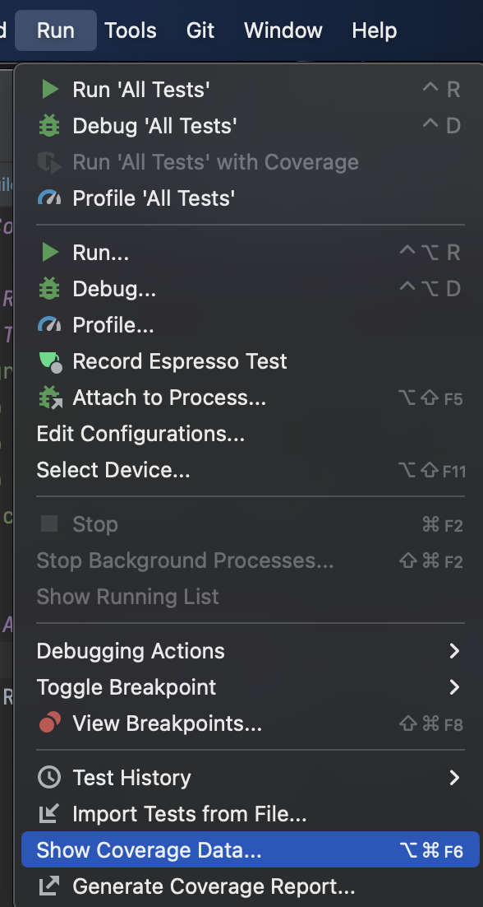
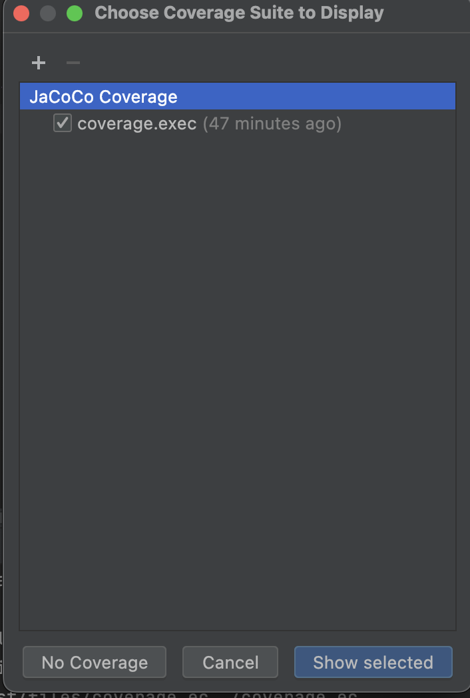
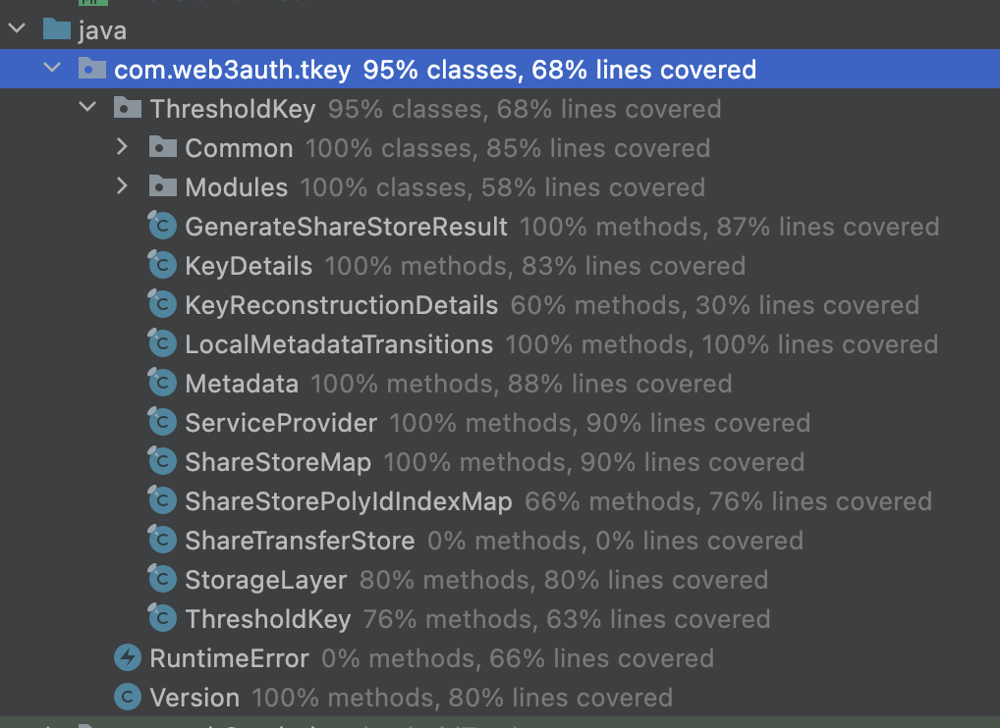

# Code Coverage for Android Instrumentation Tests

## Run tests via terminal
```Terminal
./gradlew clean installDebug installDebugAndroidTest
adb shell am instrument -w -r -e coverage true  -e debug false com.web3auth.tkey.test/androidx.test.runner.AndroidJUnitRunner
adb root
adb pull /data/user/0/com.web3auth.tkey.test/files/coverage.ec ./coverage.ec
```

## Generating code coverage report
```Terminal
java -jar android-jacoco-the-missing.jar -f coverage.ec -p . -c /tkey/build/intermediates/javac -s /tkey/src/main/java -r ./coverage
```

## Adding code coverage results to Android studio

### Rename coverage file

```Terminal
mv coverage.ec coverage.exec
```

### Step 1



### Step 2



### Result


